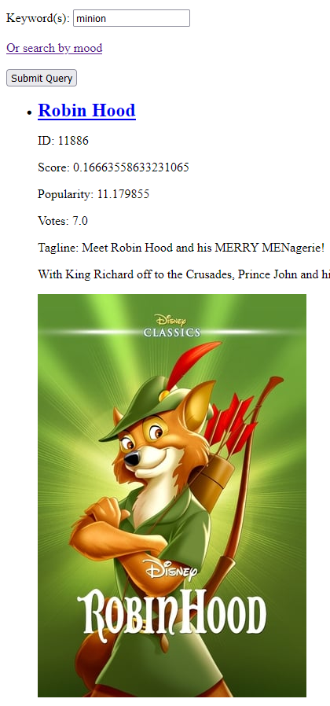
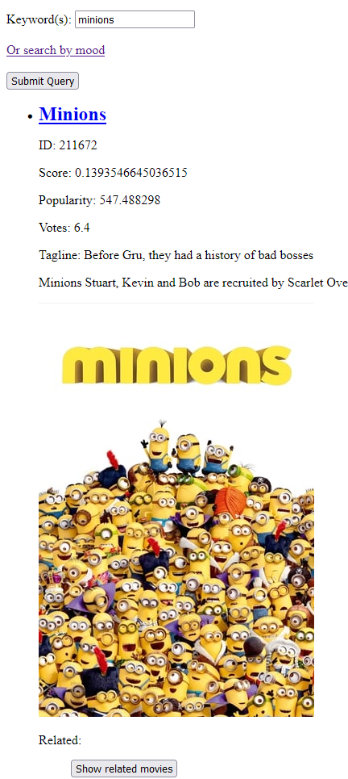

# Movie Recommender

- [Movie Recommender](#movie-recommender)
- [Background](#background)
- [Datasets](#datasets)
- [Design](#design)
- [Success Metrics](#success-metrics)
- [Milestones](#milestones)
- [Result Analysis](#result-analysis)
- [Future Work](#future-work)

Background
==========

Many recommendation systems exist, especially for movies and tv shows.
This is an attempt to establish a correlation between a user's mood and
their preferred movies.

**Goals**

To provide useful movie recommendations from a large dataset based on
user mood and related movies.

**Resources**: Google Colab, scikit-learn, numpy, sentence\_transformers

Datasets
========

Movies grouped by mood, IMDB/TMDB movie posters and genre tags

-   Movies/Shows and Mood - 1705 items: A list of movies with general
    > information and IMDB/TMDB ID, categorized by mood

<!-- -->

-   [<u>The Movies Dataset \|
    > Kaggle</u>](https://www.kaggle.com/datasets/rounakbanik/the-movies-dataset?select=movies_metadata.csv) -
    > large dataset of 40,000+ movies

Design
======

*System overview and query processing*

**For each movie in the dataset with mood labels, the movie’s title,
overview, and “tagline” are embedded.**

The user will pick a few movies that they like, their current or
preferred mood, and a few movies they have enjoyed in the past. The
recommender will compare and search for movies of similar mood, genre,
theme, etc. using the inputted moods.

The formula for sorting the returned movies to the user uses linear
combination as follows:

sum(Weightkey \* (Valuekey − Minkey) / Maxkey for key in keys) / sum(Weightall)

Where:

-   keys: the list of attributes to sort by (e.g. confidence,
    > popularity, votes)

-   weight: the weight of each key (e.g. confidence=2, popularity=1,
    > votes=1)

The movie’s title, overview, and taglines are embedded if available.

For keyword search, the ranking for each word is precomputed with word
count in the title (with weight 2), overview (with weight 0.4), and
tagline (with weight 0.1). Search queries with multiple keywords are
summed to equally weigh all keywords, and their precomputed scores
summed to determine a final ranking value. This allows search results to
be more relevant to all searched keywords.

**Embeddings of new movies are scored with the average of their cosine
similarities to each movie categorized to a mood.**

Success Metrics
===============

The application can provide movie recommendations that are relevant to
the user’s input.

**When using embeddings, the movies are categorized by mood with no
major outliers.**

**Embedded keyword search is mostly accurate, however words that are not
in the existing bag-of-words return no results.** This is because
queries are computed prior to runtime.

Milestones
==========

1.  Data Collection - IMDB reviews, movies associated with moods.
    > View in scraped\_data.

2.  Data Processing - Established word count in reviews
    > categorized by movies with specific moods. View in
    > scraped\_data/moods.json. TODO: Build a mapping from
    > mood-to-poster and posters-to-similar-posters

3.  Build an algorithm to pick movies/shows similar to the user’s mood
    > and poster selections

4.  Create an application/frontend for the algorithm, as a demo

5.  Implement a keyword search for finding movies based on keywords
    >

6.  Cross-compare movie embeddings to establish a list of related movies
    > for each movie

7.  Test keyword search by embedding keywords and comparing to movie
    > embeddings

Result Analysis
===============

The TF-IDF and word count methods to categorize movies by mood were not
sufficient. The beginning dataset was too small to provide a notable
frequency of shared words between movies.

**BERT embedding is more suitable for categorizing movies by mood
because it can detect synonyms and have a distance/similarity metric.**

**Embedding the keywords also allowed for more possible searches because
the search query is not exact.** Scenarios exist where word-count search
yields little results while embedding does.

For example, with word-count, searching for “minion” yields “Robin Hood”
but “minions” yields the “Minions” movie.

Word count search:

Embedded keyword search:

&gt; query: minion

-----

Minions

Minions Stuart, Kevin and Bob are recruited by Scarlet Overkill, a
super-villain who, alongside her inventor husband Herb, hatches a plot
to take over the world.

-----

Small Fry

A fast food restaurant mini variant of Buzz forcibly switches places
with the real Buzz and his friends have to deal with the obnoxious
impostor.

-----

The Sandlot

Scotty Smalls moves to a new neighborhood with his mom and stepdad, and
wants to learn to play baseball. The neighborhood baseball guru
Rodriquez takes Smalls under his wing. They fall into adventures
involving baseball, treehouse sleep-ins, the desirous lifeguard at the
local pool, the snooty rival ball team, and the travelling fair.

-----

&gt; query: minions

-----

Minions

Minions Stuart, Kevin and Bob are recruited by Scarlet Overkill, a
super-villain who, alongside her inventor husband Herb, hatches a plot
to take over the world.

-----

Honey, I Shrunk the Kids

The scientist father of a teenage girl and boy accidentally shrinks his
and two other neighborhood teens to the size of insects. Now the teens
must fight diminutive dangers as the father searches for them.

-----

Small Soldiers

When missile technology is used to enhance toy action figures, the toys
soon begin to take their battle programming too seriously.

-----

 

Future Work
===========

Implement a user feedback of preferred movies and posters to create more
suggestions.

Use aggregated similarity for comparing embeddings.

Create specific model for embedding mood vectors.
